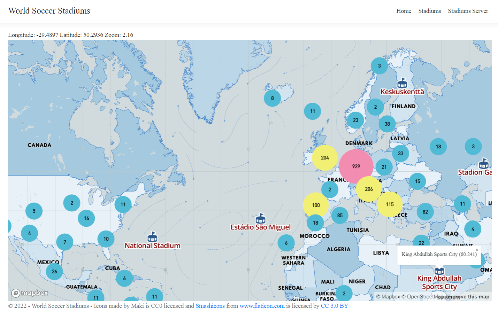

# Instruction!
Getting started
 -  A Mapbox access token. You can request a new token here: [https://account.mapbox.com/](https://account.mapbox.com/) Add an .env file with REACT_APP_MAPBOX_ACCESS_TOKEN = <your_key> in order to make it fully functional. 
 -  Mapbox GL JS. Mapbox GL JS is a JavaScript library used for building web maps.
 -  A text editor. Use the text editor of your choice for writing HTML, CSS, and JavaScript.
 -  Node.js and npm. To run the commands necessary to run your React app locally, install Node.js and npm.
 -  Working familiarity with React.  
 -  Data is stored in the /Data folder as json file.

## .net 6.0.x

 It's a .net mvc project. There are two controllers dealing with data, one is for the tabular data, the other for the geo markers.

## node.js and react

Using:
        "react": "^16.8.6",
        "react-table": "^6.10.0"
        "mapbox-gl": "^2.6.1" 

 